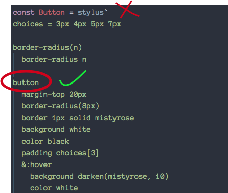
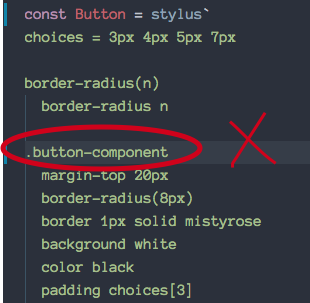

# stylus-in-react
[](https://travis-ci.org/nitin42/stylus-in-react)


> Style React components with Stylus

<br/>

<p align="center">
  
</p>

## Introduction

I assume you know what [Stylus](http://stylus-lang.com/) is and how it can be  used in an expressive way to generate CSS. With `stylus-in-react`, you can directly style your React components with Stylus.

Sound's cool! Let's see how...

**Example**

```jsx
import React from 'react';
import stylus from 'stylus-in-react';

const Button = stylus`
button-styles(width, radius, style, color)
  border-radius radius
  border width style color
  padding 5px
  color purple
  
button
  button-styles(3px, 4px, solid, mistyrose)
  &:hover
    color pink
    background-color lighten(mistyrose, 20)
`

class App extends React.Component {
  render() {
    return (
      <Button>Search</Button>
    );
  }
}
```

## Install

```
npm install stylus-in-react
```
This also depends on React so make sure you've already installed it!

After you're done with the installation, place this in your `index.html`

**IMPORTANT - This is required for client side usage of Stylus**

```
<script src="https://cdn.rawgit.com/nitin42/e860b57e7d72a0cdc34ae0388cd8c6e9/raw/dae9a1a254b26ea951903cbb2d918e13f63db5e0/stylus.min.js"></script>
```


## Usage
No new api to learn. Just use 'stylus\`\`' and you are good to go.

```jsx
const StyledDiv = stylus`
div
  padding 20px
  width 400px
`

<StyledDiv>Hello World</StyledDiv>
```

### Creating a Stylus component

To create a Stylus component, you need to pass an element name for eg - `button` like this 

<p align="center">
  
</p>

**Note** - This will give error (**classname is not supported**)

<p align="center">
  
</p>


## ** Supported Stylus features **

Supported features - 

* [variables](http://stylus-lang.com/docs/variables.html)
* [mixins](http://stylus-lang.com/docs/mixins.html)
* [functions](http://stylus-lang.com/docs/functions.html)
* [built-in functions](http://stylus-lang.com/docs/bifs.html)
* [selectors](http://stylus-lang.com/docs/selectors.html) (pseudo selectors, nested selectors, descendant-selectors)
* [interpolations](http://stylus-lang.com/docs/interpolation.html)
* [operators](http://stylus-lang.com/docs/operators.html)
* [keywords arguments](http://stylus-lang.com/docs/kwargs.html)
* [rest params](http://stylus-lang.com/docs/vargs.html)
* [conditionals](http://stylus-lang.com/docs/conditionals.html)
* [block](http://stylus-lang.com/docs/block.html)
* [char escaping](http://stylus-lang.com/docs/escape.html)

## ** Caveats **

**Stylus is “pythonic” (i.e. indentation-based) so it will throw errors when indentation is not correct.**

<p align="center">
  
</p>

## FAQs

### 1. What about `keyframes`, `media` and other `@rules` ??

Work in progress!

### 2. Vendor prefixes ?

`stylus-in-react` automatically adds all the required prefixes for the browser versions -

**Chrome: 46+**

**Android (Chrome): 46+**

**Android (Stock Browser): 4+**

**Android (UC): 9+**

**Firefox: 40+**

**Safari: 8+**

**iOS (Safari): 8+**

**Opera: 16+**

**Opera (Mini): 12+**

**IE: 11+**

**IE (Mobile): 11+**

**Edge: 12+**

### 3. Indentation ?

Yup! It's weird I know but this will be straighten out soon 😉

## License

MIT

